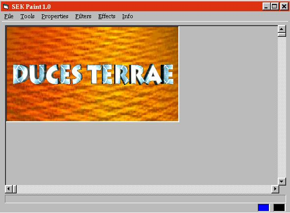



## SEK Paint 1\.1

### Description

Here's what the code can do:

19 Painting-Tools including Brush or Userdefined Polygons.

15 Filters like Ice, Invert or Emboss.

05 Effects like Flipping or Wave.

You can pass a Commandline to the App.

Open and save pictures.

Print pictures.

The CommonDialog-Control.

***UPDATE*** I've added some new features. Check it out!
 
### More Info
 

             |
---                |---
**Submitted On**   |2000-06-07 16:12:56
**By**             |[Stephan Kirchmaier](https://github.com/Planet-Source-Code/PSCIndex/blob/master/ByAuthor/stephan-kirchmaier.md)
**Level**          |Advanced
**User Rating**    |4.7 (136 globes from 29 users)
**Compatibility**  |VB 5\.0, VB 6\.0
**Category**       |[Complete Applications](https://github.com/Planet-Source-Code/PSCIndex/blob/master/ByCategory/complete-applications__1-27.md)
**World**          |[Visual Basic](https://github.com/Planet-Source-Code/PSCIndex/blob/master/ByWorld/visual-basic.md)
**Archive File**   |[CODE\_UPLOAD6523672000\.zip](https://github.com/Planet-Source-Code/stephan-kirchmaier-sek-paint-1-1__1-8514/archive/master.zip)

### API Declarations

see code and pls. come back and vote for me!

